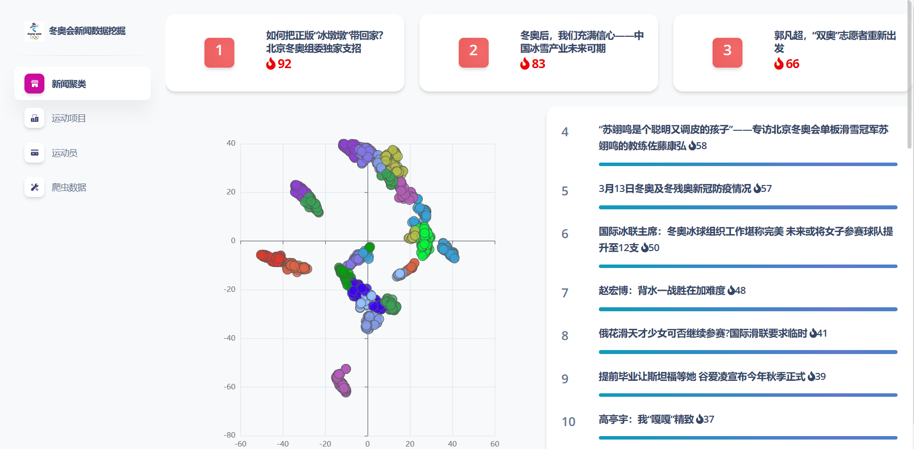
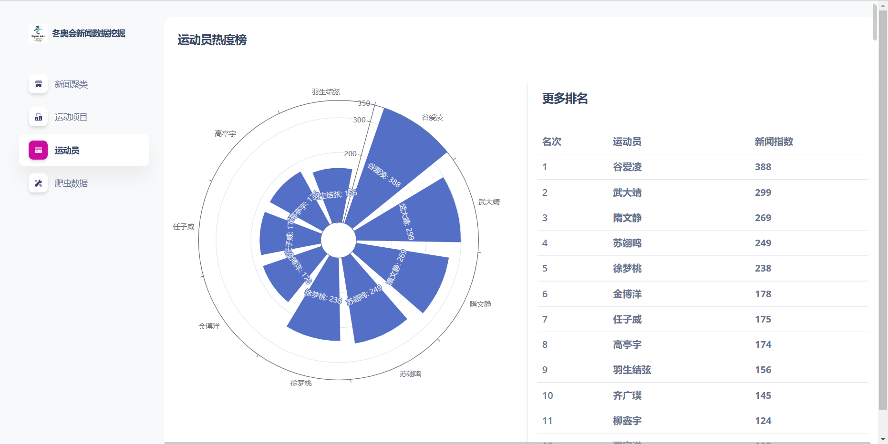

# 冬奥会新闻数据爬取与挖掘系统





## 微信联系我 有偿修改 wx: bytecola

<p class="mb-5">从北京冬奥会官网，新华网、中国网、人民网等新闻网站冬奥主题页面的新闻进行爬取、存储、分词、训练、挖掘。</p>
<h6 class="font-weight-bolder"># 爬虫</h6>
<p>
    Requests是一个简单而优雅的HTTP库。</p>
<p>
    Beautiful Soup 是一个可以从HTML或XML文件中提取数据的Python库.它能够通过你喜欢的转换器实现惯用的文档导航,查找,修改文档的方式。
</p>
<p class="mb-4">
    项目使用Reuqests库负责网络请求，Beautiful Soup进行解析处理。</p>
<h6 class="font-weight-bolder"># 存储</h6>
<p class="mb-4">
    MongoDB 是一个介于关系数据库和非关系数据库之间的产品，是非关系数据库当中功能最丰富，最像关系数据库的。</p>
<h6 class="font-weight-bolder"># 分词</h6>
<p class="mb-4">
    jieba（结巴）分词，一款优秀的中分分词工具。</p>
<h6 class="font-weight-bolder"># 训练与挖掘</h6>
<p >
    DBSCAN（Density—Based Spatial Clustering of Application with
    Noise）算法是一种典型的基于密度的聚类方法。它将簇定义为密度相连的点的最大集合，能够把具有足够密度的区域划分为簇，并可以在有噪音的空间数据集中发现任意形状的簇。</p>
<p>
    Scikit-learn(以前称为scikits.learn,也称为sklearn)是针对Python 编程语言的免费软件机器学习库。它具有各种分类,回归和聚类算法,包括支持向量机,随机森林,梯度提升,k均值和DBSCAN。
</p>
<p class="mb-4">
    在Scikit-learn中，DBSCAN算法类为sklearn.cluster.DBSCAN。
</p>
<h6 class="font-weight-bolder"># 可视化</h6>
<p>
    Flask是一个轻量级的基于Python的web框架。</p>
<p class="mb-4">
    Apache ECharts,一个基于 JavaScript 的开源可视化图表库</p>

## 爬虫数据源

### 冬奥官网

https://www.beijing2022.cn/

https://www.beijing2022.cn/cn/paralympics/newslist.htm
https://api.beijing2022.cn/search/web?callback=getList1447&language=zh&page=2&limit=50&isPar=1&is_filter=2&column=26&_=1646742126903

运动员数据

https://results.beijing2022.cn/beijing-2022/paralympic-games/zh/results/all-sports/zzeej01a.json

###网易新闻

http://sports.163.com/special/bj2022_news/

### 人民网

http://sports.people.com.cn/GB/419056/index7.html

### 中国网

http://about.china.com.cn/node_8027858.htm

### 新华网

http://www.news.cn/beijing2022/erji.htm?page=dadt


## ✨ 项目代码结构

项目主要分为数据爬虫（crawler）、数据可视化（flask home）、文本处理挖掘（text_analysis）三个主要模块。具体代码文件描述如下:

```bash
< PROJECT ROOT >
   |
   |-- crawler/                            #冬奥新闻数据爬虫
   |    |
   |    |-- athletes.py                    # 冬奥会运动员json数据
   |    |-- crawler_163_BJ2022.py          # 网易新闻爬取
   |    |-- crawler_bj2022cn.py            # 北京冬奥官网数据爬取  
   |    |-- crawler_china_BJ2022.py        # 中国网冬奥新闻数据爬取  
   |    |-- crawler_newscn_BJ2022.py       # 新华网冬奥新闻数据爬取
   |    |-- crawler_people_BJ2022.py       # 人民网冬奥新闻数据爬取
   |    |-- events.json                    # 冬奥项目
   |    |-- sites.json                     # 冬奥新闻网站
   |    |
   |-- home/                               # 浏览器数据可视化
   |    |
   |    |-- routes.py                      # url路由定义
   |    |
   |-- static/                             # Flask Web 静态资源文件夹 
   |    |-- <css, JS, images>               # CSS files, Javascripts files 
   | 
   |-- templates/                          # Flask Web 页面模板
   |    |-- includes/                      # HTML chunks and components
   |    |    |-- navigation.html           # Top menu component
   |    |    |-- sidebar.html              # Sidebar component
   |    |    |-- footer.html               # App Footer
   |    |    |-- scripts.html              # Scripts common to all pages
   |    |
   |    |-- layouts/                       # Master pages
   |    |    |-- base.html                 # Used by common pages
   |    |
   |    |-- home/                          # 功能模块页面
   |
   |    |    |-- index.html                # 首页
   |    |    |-- crawler.html              # 爬虫数据统计
   |    |    |-- events.html               # 运动项目
   |    |    |-- athletes.html             # 运动员
   |    |    |-- subjects.html             # 新闻聚类
   |    |    |-- subjects_detail.html      # 新闻聚类详情
   |    |    |-- page-403.html             # 403 error page
   |    |    |-- page-404.html             # 404 error page
   |    |    |-- page-500.html             # 500 error pages
   |    
   |-- text_analysis/                      # 文本分词挖掘
   |    |
   |    |-- counter.py                     # 单词频率统计公共方法
   |    |-- drawing.py                     # 图标绘图方法，使用 matplotlib
   |    |-- modeling.py                    # 文本模型定义 
   |    |-- text_mining.py                 # 文本聚类挖掘
   |    |-- text_processing.py             # 文本分词处理 使用jieba
   |
   |-- utils/                              # 工具类
   |    |
   |    |-- database.py                    # mongodb数据库操作工具类
   |-- venv/                               # python 虚拟环境
   |
   |-- chinese_stop_words.txt              # 中文无意义词汇去除
   |-- run_extract_mining_data.py          # 文本分词与聚类执行文件
   |-- run_flask.py                        # Flask 执行文件
   |-- run_news_crawler.py                 # 新闻爬虫文件

   |-- requirements.txt                     # Development modules
   |
   |-- ************************************************************************
```

<br />

## 👉 赞助一下

